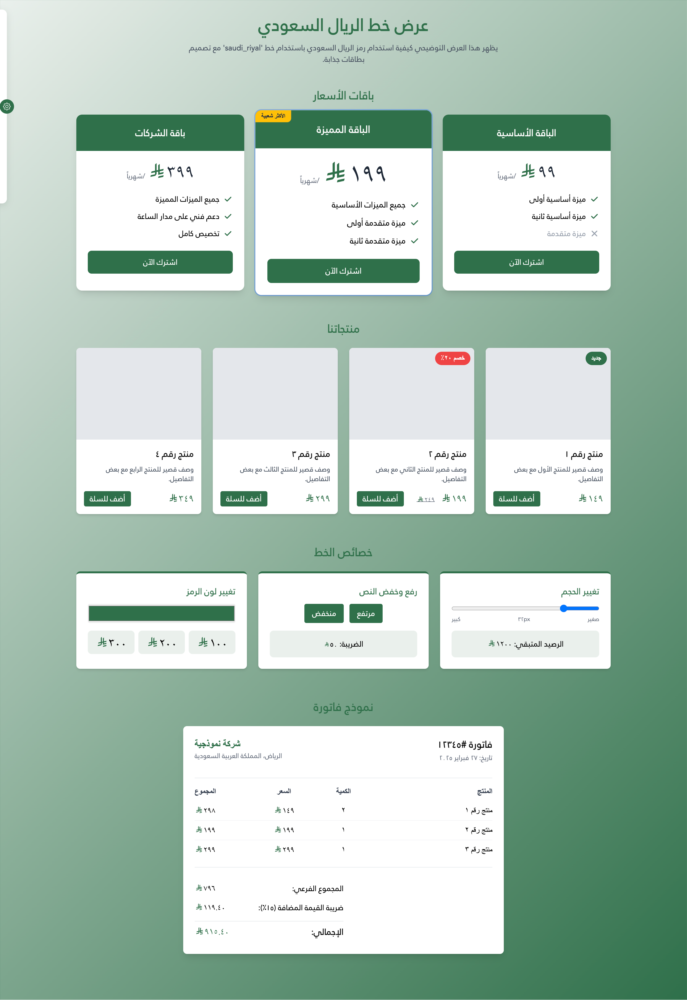

# 🇸🇦 Saudi Riyal Font  

**A community-maintained open-source font for the Saudi Riyal currency symbol.**  

This font allows you to use the **Saudi Riyal symbol** in websites, applications, and documents, ensuring compatibility where the symbol is not natively supported.  


---

**📦 Package Information**

[](https://www.npmjs.com/package/@emran-alhaddad/saudi-riyal-font)
[](https://www.npmjs.com/package/@emran-alhaddad/saudi-riyal-font)
[](https://www.jsdelivr.com/package/npm/@emran-alhaddad/saudi-riyal-font)
[](https://github.com/emran-alhaddad/Saudi-Riyal-Font)
[](https://emran-alhaddad.github.io/Saudi-Riyal-Font/examples/demo.html)

**📊 Repository Stats**

[](https://github.com/emran-alhaddad/Saudi-Riyal-Font/stargazers)
[](https://github.com/emran-alhaddad/Saudi-Riyal-Font/network/members)
[](https://github.com/emran-alhaddad/Saudi-Riyal-Font/issues)
[](https://github.com/emran-alhaddad/Saudi-Riyal-Font)
[](https://github.com/emran-alhaddad/Saudi-Riyal-Font/graphs/contributors)
[](https://github.com/emran-alhaddad/Saudi-Riyal-Font/releases)
[](https://github.com/emran-alhaddad/Saudi-Riyal-Font/commits)

**🔄 Compatibility**

[](https://emran-alhaddad.github.io/Saudi-Riyal-Font/examples/demo.html)
[](https://github.com/emran-alhaddad/Saudi-Riyal-Font)
[](https://www.typescriptlang.org/)

**📈 Project Status**

[](https://github.com/emran-alhaddad/Saudi-Riyal-Font/blob/main/LICENSE.txt)
[](https://emran-alhaddad.github.io/Saudi-Riyal-Font/examples/demo.html)
[](https://github.com/emran-alhaddad/Saudi-Riyal-Font/graphs/commit-activity)
[](https://github.com/emran-alhaddad/Saudi-Riyal-Font/pulls)
[](https://opensource.org/)

**👥 Social**

[](https://www.linkedin.com/in/emran-alhaddad/)
[](https://github.com/emran-alhaddad)
[](https://github.com/emran-alhaddad/Saudi-Riyal-Font)

## 🌍 Live Demo  
🎉 **Check out the live demo here:**  
🔗 [Saudi Riyal Font Demo](https://emran-alhaddad.github.io/Saudi-Riyal-Font/examples/demo.html)  

Below is a screenshot of the example demo page:  



---

## 📌 Features  
👉 **Cross-Platform Compatibility** – Works on Windows, macOS, Linux, Web, and Mobile.  
👉 **Unicode Private Use Area (`U+E900`)** – Ensures seamless integration.  
👉 **Web-Optimized** – Includes `.woff`, `.woff2`, and `.ttf` formats for fast loading.  
👉 **NPM Support** – Easily install via NPM for web projects.  
👉 **CDN Hosting** – Use without installation via **jsDelivr** or **unpkg**.  
👉 **Open Source & Free** – Released under the **SIL Open Font License (OFL)**.  
👉 **Customizable** – Modify and enhance as needed.  

---

## 💍 Installation & Usage  

### **1️⃣ Install via NPM (Recommended for Web Developers)**  
The easiest way to use this font in a web project is by installing it via NPM:  

```sh
npm install @emran-alhaddad/saudi-riyal-font
```

Then, import it in your project:  

```js
import '@emran-alhaddad/saudi-riyal-font/index.css';
```

Use it in HTML:  

```html
<span class="icon-saudi_riyal"></span>
```

Alternatively, insert the symbol using Unicode:  

```html
<span style="font-family: 'saudi_riyal'">&#xE900;</span>
```

---

### **2️⃣ Web Usage via CDN (No Installation Needed)**  

#### **📌 Use jsDelivr CDN**
```html
<link rel="stylesheet" href="https://cdn.jsdelivr.net/npm/@emran-alhaddad/saudi-riyal-font/index.css">
```

#### **📌 Use unpkg CDN**
```html
<link rel="stylesheet" href="https://unpkg.com/@emran-alhaddad/saudi-riyal-font/index.css">
```

#### **CDN HTML Example:**
```html
<!DOCTYPE html>
<html lang="en">
<head>
    <meta charset="UTF-8">
    <meta name="viewport" content="width=device-width, initial-scale=1.0">
    <title>Saudi Riyal Font Demo</title>
    <link rel="stylesheet" href="https://cdn.jsdelivr.net/npm/@emran-alhaddad/saudi-riyal-font/index.css">
</head>
<body>

    <h1>Saudi Riyal Font Demo</h1>
    <p>Price: <span class="icon-saudi_riyal"></span> 100</p>

</body>
</html>
```

---

## 📝 Setup for Desktop & Mobile Devices  

### **3️⃣ Download & Install on Windows, Mac, Linux, Android, iOS**  
#### **📂 Download Saudi Riyal Font Files:**  
📂 **[Download Saudi Riyal Font](https://github.com/emran-alhaddad/Saudi-Riyal-Font/blob/main/fonts/saudi_riyal.ttf)**  

### **🖥 Windows Installation**  
1. Download `saudi_riyal.ttf` from the link above.  
2. Right-click the file and select **"Install"**.  
3. Open **Microsoft Word, Photoshop, or any editor**, select **"Saudi Riyal"** as the font.  
4. Type `E900` and press `Alt + X` to display the Saudi Riyal symbol.  

### **💻 Mac Installation**  
1. Download `saudi_riyal.ttf` from the link above.  
2. Double-click the file and select **"Install Font"**.  
3. Open any text editor (e.g., Pages, Photoshop), select **"Saudi Riyal"** as the font.  
4. Type `E900` to insert the Riyal symbol.  

### **🐧 Linux Installation**  
1. Copy the font to your local fonts directory:  
   ```sh
   cp saudi_riyal.ttf ~/.fonts/
   fc-cache -fv
   ```  
2. Use it in applications that support custom fonts.  

### **🌐 Mobile Installation (Android & iOS)**  
1. Download `saudi_riyal.ttf` to your phone.  
2. **Android:** Use **iFont** or **FontFix** apps to install.  
3. **iOS:** Install via **iFont** or a font management app.  
4. Use in supported apps like Word, Photoshop, or Notes.  

---

## 🌟 Development & Contributions  
We welcome **contributions!** To contribute:  
1. **Fork** this repository.  
2. **Make your changes** (improve the font, add glyphs).  
3. **Submit a Pull Request** for review.  

If you find issues, please report them via the [Issues](https://github.com/emran-alhaddad/saudi-riyal-font/issues) section.  

---

## 📚 License  
This font is released under the **SIL Open Font License (OFL)**.  
✅ **Attribution is required!**  

📌 **Created by:** **Emran Alhaddad**  
📧 **Contact:** emran.alhaddad.dev@gmail.com  

📢 **Any usage, modification, or distribution must credit the original creator.**  
```
Saudi Riyal Font © Emran Alhaddad - Used under SIL Open Font License 1.1
```

---

## 📧 Contact  
📩 For questions, feedback, or collaborations, reach out via [GitHub Issues](https://github.com/emran-alhaddad/saudi-riyal-font/issues) or email at **emran.alhaddad.dev@gmail.com**.  

---

🚀 **Enjoy the Saudi Riyal Font!**  
