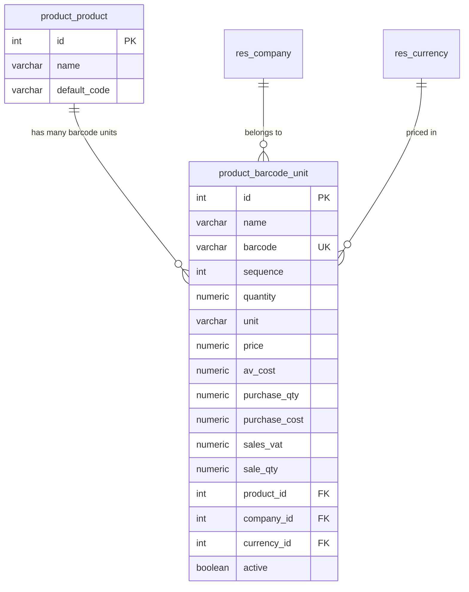

# Product Multi Unit Barcode - Complete Guide

## Overview
The Product Multi Unit Barcode module extends Odoo's product and pricing system to support multiple packaging units with individual barcodes and pricing, integrated with pricelist rules.

## Features

### Core Functionality
- **Multiple Units per Product**: Define different packaging units (pieces, cartons, boxes, etc.)
- **Individual Barcodes**: Each unit has its own unique barcode
- **Individual Pricing**: Set different prices for each unit type
- **Cost Management**: Track purchase costs and sales pricing per unit
- **Pricelist Integration**: Create specific pricing rules for different units

### Pricelist Integration (NEW)
- **Multi-Unit Pricing Rules**: Create pricelist rules that apply to specific barcode units
- **Maximum Quantity Limits**: Set upper limits for pricing rule applicability
- **Inline Editing**: Add and edit pricelist rules directly in the pricelist form
- **Advanced Rule Filtering**: Rules can be filtered by product, variant, and barcode unit

## Setup Instructions

### 1. Product Configuration

#### Adding Barcode Units to Products
1. Go to **Inventory > Products > Products**
2. Open any product or create a new one
3. Navigate to the **Barcode Options** tab
4. Click **Add a line** to create new barcode units

#### Barcode Unit Fields
- **Name**: Descriptive name (e.g., "Single Bottle", "6-Pack", "Carton")
- **Sequence**: Display order
- **Barcode**: Unique barcode for this unit
- **Quantity**: Number of base units in this packaging
- **Unit**: Unit of measure
- **Price**: Sales price for this unit
- **Average Cost**: Cost per unit
- **Purchase Quantity**: Default purchase quantity
- **Purchase Cost**: Purchase cost
- **Sales VAT**: VAT percentage
- **Sale Quantity**: Default sales quantity

### 2. Pricelist Configuration

#### Creating Multi-Unit Pricing Rules
1. Go to **Sales > Configuration > Pricelists**
2. Open an existing pricelist or create a new one
3. In the **Price Rules** tab, you can now:
   - **Add lines directly** using the inline editor
   - **Select Multi Unit** from the dropdown for specific barcode units
   - **Set Max. Quantity** to limit rule applicability

#### Pricelist Rule Fields
- **Products**: Select the product template
- **Variants**: Select specific product variants (if applicable)
- **Multi Unit**: Select specific barcode unit for targeted pricing
- **Min. Quantity**: Minimum quantity for rule to apply
- **Max. Quantity**: Maximum quantity for rule to apply
- **Price**: The price for this rule
- **Start Date / End Date**: Validity period

#### Rule Priority and Application
- Rules are applied based on specificity and sequence
- Multi-unit rules have priority over general product rules
- Rules with barcode units only apply when that specific unit is selected
- Max quantity ensures rules only apply within specified limits

### 3. Usage Examples

#### Example 1: Coca Cola Product Setup
```
Product: Coca Cola 500ml

Barcode Units:
1. Single Bottle
   - Barcode: 1234567890123
   - Quantity: 1
   - Price: $1.50

2. 6-Pack
   - Barcode: 1234567890130
   - Quantity: 6
   - Price: $8.00

3. Carton (24 bottles)
   - Barcode: 1234567890147
   - Quantity: 24
   - Price: $30.00
```

#### Example 2: Pricelist Rules Setup
```
Public Pricelist Rules:

1. Coca Cola - Single Bottle
   - Multi Unit: Single Bottle
   - Min Qty: 1, Max Qty: 5
   - Price: $1.50

2. Coca Cola - 6-Pack
   - Multi Unit: 6-Pack
   - Min Qty: 1, Max Qty: 10
   - Price: $8.00

3. Coca Cola - Carton (Bulk Discount)
   - Multi Unit: Carton
   - Min Qty: 1, Max Qty: 50
   - Price: $28.00
```

## Benefits

### For Businesses
1. **Flexible Pricing**: Different prices for different packaging units
2. **Inventory Efficiency**: Track multiple packaging levels
3. **Barcode Integration**: Seamless scanning and identification
4. **Cost Control**: Better understanding of unit economics
5. **Customer Options**: Offer various purchase quantities

### For Pricelist Management
1. **Granular Control**: Specific pricing for specific units
2. **Quantity Limits**: Ensure rules apply within intended ranges
3. **Easy Management**: Inline editing for quick updates
4. **Flexible Rules**: Combine product, variant, and unit-specific pricing
5. **Integration**: Works seamlessly with existing Odoo pricing

## Technical Details

### Models Extended
- `product.template`: Added barcode unit relationships
- `product.product`: Added barcode unit relationships  
- `product.pricelist.item`: Added multi-unit and max quantity fields
- `product.pricelist`: Extended price computation methods

### New Model
- `product.barcode.unit`: Central model for multi-unit definitions

### Views Enhanced
- Product forms: Added "Barcode Options" tab
- Pricelist forms: Enhanced with multi-unit columns and inline editing
- Pricelist rules: Extended forms with new fields

## Installation Status
✅ **Successfully Installed**
- Module: `product_multi_barcode`
- Version: 17.0.1.0.0
- Database: `forapi_17`
- All features are active and ready to use

## Next Steps
1. Start by adding barcode units to your existing products
2. Create specific pricelist rules for different units
3. Test the pricing functionality with different quantities
4. Train your team on the new multi-unit options

The system is now ready for production use with comprehensive multi-unit barcode and pricing support!

---

## 🎯 Overview

This custom Odoo module implements a **multi-units barcode system** that allows products to have multiple barcode variations with different quantities, pricing, and configurations. This is particularly useful for products like beverages where you might have:

- **Individual can** (1 unit, $1.50)
- **6-pack** (6 units, $8.00) 
- **24-pack carton** (24 units, $28.00)

Each variation can have its own barcode, pricing structure, and sales configuration.

---

## 🗄️ Database Structure

### Primary Table: `product_barcode_unit`

This is the core table that stores all barcode unit variations for products.

```sql
CREATE TABLE product_barcode_unit (
    id SERIAL PRIMARY KEY,
    name VARCHAR NOT NULL,                    -- Unit name (e.g., "6-Pack", "Carton")
    barcode VARCHAR,                          -- Unique barcode for this unit
    sequence INTEGER DEFAULT 10,             -- Display order
    quantity NUMERIC DEFAULT 1.0,            -- Quantity in this unit
    unit VARCHAR,                             -- Unit description
    price NUMERIC,                            -- Selling price
    av_cost NUMERIC,                          -- Average cost
    purchase_qty NUMERIC,                     -- Purchase quantity
    purchase_cost NUMERIC,                    -- Purchase cost
    sales_vat NUMERIC,                        -- Sales price including VAT
    sale_qty NUMERIC,                         -- Sales quantity
    product_id INTEGER REFERENCES product_product(id), -- Link to product variant
    company_id INTEGER REFERENCES res_company(id),     -- Multi-company support
    currency_id INTEGER REFERENCES res_currency(id),   -- Currency reference
    active BOOLEAN DEFAULT TRUE,              -- Active/inactive flag
    create_date TIMESTAMP DEFAULT NOW(),     -- Creation timestamp
    create_uid INTEGER REFERENCES res_users(id),       -- Creator user
    write_date TIMESTAMP DEFAULT NOW(),      -- Last modification timestamp
    write_uid INTEGER REFERENCES res_users(id)         -- Last modifier user
);
```

### Key Database Relationships



---

## 🔧 Technical Implementation

### 1. Core Model: `ProductBarcodeUnit`

**File:** `models/product_barcode_unit.py`

```python
class ProductBarcodeUnit(models.Model):
    _name = 'product.barcode.unit'
    _description = 'Product Barcode Unit'
    _order = 'sequence, name'

    # Core identification fields
    name = fields.Char('Unit Name', required=True)
    barcode = fields.Char('Barcode', index=True)
    sequence = fields.Integer('Sequence', default=10)
    
    # Quantity and unit information
    quantity = fields.Float('Quantity', default=1.0)
    unit = fields.Char('Unit')
    
    # Pricing fields
    price = fields.Monetary('Price', currency_field='currency_id')
    av_cost = fields.Monetary('Average Cost', currency_field='currency_id')
    purchase_qty = fields.Float('Purchase Quantity')
    purchase_cost = fields.Monetary('Purchase Cost', currency_field='currency_id')
    sales_vat = fields.Monetary('Sales+VAT', currency_field='currency_id')
    sale_qty = fields.Float('Sale Quantity')
    
    # Relationships and system fields
    product_id = fields.Many2one('product.product', 'Product', required=True)
    company_id = fields.Many2one('res.company', 'Company', default=lambda self: self.env.company)
    currency_id = fields.Many2one('res.currency', related='company_id.currency_id')
    active = fields.Boolean('Active', default=True)
```

### 2. Product Extensions

**File:** `models/product_product.py`

```python
class ProductProduct(models.Model):
    _inherit = 'product.product'
    
    barcode_unit_ids = fields.One2many(
        'product.barcode.unit', 
        'product_id', 
        string='Barcode Units'
    )
    
    barcode_unit_count = fields.Integer(
        'Barcode Units Count',
        compute='_compute_barcode_unit_count'
    )
```

### 3. Database Constraints

```sql
-- Unique barcode constraint
ALTER TABLE product_barcode_unit 
ADD CONSTRAINT product_barcode_unit_barcode_uniq 
UNIQUE (barcode);

-- Indexes for performance
CREATE INDEX idx_product_barcode_unit_product_id ON product_barcode_unit(product_id);
CREATE INDEX idx_product_barcode_unit_barcode ON product_barcode_unit(barcode);
CREATE INDEX idx_product_barcode_unit_company_id ON product_barcode_unit(company_id);
```

---

## 📊 Data Structure for Synchronization

### JSON Structure for API Integration

When syncing data, use this JSON structure:

```json
{
    "product_id": 123,
    "barcode_units": [
        {
            "name": "Individual Can",
            "barcode": "1234567890123",
            "sequence": 10,
            "quantity": 1.0,
            "unit": "can",
            "price": 1.50,
            "av_cost": 0.90,
            "purchase_qty": 1.0,
            "purchase_cost": 0.85,
            "sales_vat": 1.73,
            "sale_qty": 1.0,
            "active": true
        },
        {
            "name": "6-Pack",
            "barcode": "1234567890124",
            "sequence": 20,
            "quantity": 6.0,
            "unit": "pack",
            "price": 8.00,
            "av_cost": 5.40,
            "purchase_qty": 6.0,
            "purchase_cost": 5.10,
            "sales_vat": 9.20,
            "sale_qty": 6.0,
            "active": true
        }
    ]
}
```

### Database Sync Queries

**Insert new barcode unit:**
```sql
INSERT INTO product_barcode_unit 
(name, barcode, sequence, quantity, unit, price, av_cost, purchase_qty, 
 purchase_cost, sales_vat, sale_qty, product_id, company_id, currency_id)
VALUES 
('6-Pack', '1234567890124', 20, 6.0, 'pack', 8.00, 5.40, 6.0, 
 5.10, 9.20, 6.0, 123, 1, 1);
```

**Update existing barcode unit:**
```sql
UPDATE product_barcode_unit 
SET price = 8.50, av_cost = 5.60, sales_vat = 9.78
WHERE barcode = '1234567890124';
```

**Bulk sync query:**
```sql
-- Use UPSERT pattern for PostgreSQL
INSERT INTO product_barcode_unit 
(name, barcode, sequence, quantity, unit, price, av_cost, purchase_qty, 
 purchase_cost, sales_vat, sale_qty, product_id, company_id, currency_id)
VALUES 
-- Your data here
ON CONFLICT (barcode) 
DO UPDATE SET
    name = EXCLUDED.name,
    price = EXCLUDED.price,
    av_cost = EXCLUDED.av_cost,
    sales_vat = EXCLUDED.sales_vat,
    write_date = NOW();
```

---

## 🚀 Installation Process

### 1. Module Structure
```
product_multi_barcode/
├── __manifest__.py              # Module manifest
├── __init__.py                  # Module initialization
├── models/
│   ├── __init__.py
│   ├── product_barcode_unit.py  # Core model
│   ├── product_product.py       # Product variant extension
│   └── product_template.py      # Product template extension
├── views/
│   ├── product_barcode_unit_views.xml  # Main views
│   ├── product_product_views.xml       # Product variant views
│   └── product_template_views.xml      # Product template views
├── security/
│   └── ir.model.access.csv      # Access rights
├── data/
│   └── product_barcode_unit_data.xml   # Initial data
└── migrations/
    └── 17.0.1.0.0/
        └── post-migration.py    # Migration script
```

### 2. Database Migration

The module automatically creates the database table on installation. For manual setup:

```sql
-- Create the main table
CREATE TABLE IF NOT EXISTS product_barcode_unit (
    id SERIAL PRIMARY KEY,
    name VARCHAR NOT NULL,
    barcode VARCHAR,
    sequence INTEGER DEFAULT 10,
    quantity NUMERIC DEFAULT 1.0,
    unit VARCHAR,
    price NUMERIC,
    av_cost NUMERIC,
    purchase_qty NUMERIC,
    purchase_cost NUMERIC,
    sales_vat NUMERIC,
    sale_qty NUMERIC,
    product_id INTEGER REFERENCES product_product(id) ON DELETE CASCADE,
    company_id INTEGER REFERENCES res_company(id),
    currency_id INTEGER REFERENCES res_currency(id),
    active BOOLEAN DEFAULT TRUE,
    create_date TIMESTAMP DEFAULT NOW(),
    create_uid INTEGER REFERENCES res_users(id),
    write_date TIMESTAMP DEFAULT NOW(),
    write_uid INTEGER REFERENCES res_users(id)
);

-- Add constraints and indexes
ALTER TABLE product_barcode_unit ADD CONSTRAINT product_barcode_unit_barcode_uniq UNIQUE (barcode);
CREATE INDEX idx_product_barcode_unit_product_id ON product_barcode_unit(product_id);
CREATE INDEX idx_product_barcode_unit_barcode ON product_barcode_unit(barcode);
```

---

## 🔌 API Integration

### Odoo XML-RPC Example

```python
import xmlrpc.client

# Connection
url = 'http://localhost:8069'
db = 'forapi_17'
username = 'admin'
password = 'admin'

common = xmlrpc.client.ServerProxy(f'{url}/xmlrpc/2/common')
uid = common.authenticate(db, username, password, {})

models = xmlrpc.client.ServerProxy(f'{url}/xmlrpc/2/object')

# Create barcode unit
barcode_unit_id = models.execute_kw(db, uid, password,
    'product.barcode.unit', 'create',
    [{
        'name': '6-Pack',
        'barcode': '1234567890124',
        'quantity': 6.0,
        'unit': 'pack',
        'price': 8.00,
        'product_id': 123,
    }])

# Search and read barcode units
barcode_units = models.execute_kw(db, uid, password,
    'product.barcode.unit', 'search_read',
    [['product_id', '=', 123]],
    {'fields': ['name', 'barcode', 'quantity', 'price']})
```

### REST API Example (if using Odoo REST API module)

```python
import requests

# Create barcode unit
response = requests.post('http://localhost:8069/api/product.barcode.unit', 
    json={
        'name': '6-Pack',
        'barcode': '1234567890124',
        'quantity': 6.0,
        'unit': 'pack',
        'price': 8.00,
        'product_id': 123,
    },
    headers={'Authorization': 'Bearer YOUR_TOKEN'})
```

---

## 📱 User Interface

### 1. Product Form Integration

The module adds a **"Barcode Options"** tab to product forms where users can:
- Add multiple barcode units
- Set individual pricing for each unit
- Configure quantities and units
- Manage sequence/order

### 2. Standalone Barcode Units Menu

Location: **Inventory → Configuration → Products → Barcode Units**

This provides a centralized view of all barcode units across all products.

---

## 🔄 Data Synchronization Best Practices

### 1. Sync Strategy

**Recommended approach:**
1. **Product-first sync**: Ensure products exist before syncing barcode units
2. **Batch processing**: Use bulk operations for better performance
3. **Conflict resolution**: Use barcode as unique identifier for updates
4. **Error handling**: Log failed syncs for manual review

### 2. Sync Frequency

- **Real-time**: For critical price updates
- **Hourly**: For inventory-related changes
- **Daily**: For bulk product catalog updates

### 3. Data Validation

```python
def validate_barcode_unit_data(data):
    """Validate barcode unit data before sync"""
    required_fields = ['name', 'product_id']
    for field in required_fields:
        if not data.get(field):
            raise ValueError(f"Missing required field: {field}")
    
    if data.get('barcode') and len(data['barcode']) < 8:
        raise ValueError("Barcode must be at least 8 characters")
    
    if data.get('quantity', 0) <= 0:
        raise ValueError("Quantity must be positive")
```

---

## 📈 Performance Considerations

### Database Optimization

1. **Indexes**: Key indexes are automatically created
2. **Archival**: Use `active=False` instead of deleting records
3. **Partitioning**: Consider partitioning by company_id for large datasets

### Caching Strategy

```python
# Example caching for frequently accessed barcode units
@tools.ormcache('product_id')
def get_product_barcode_units(self, product_id):
    return self.search([('product_id', '=', product_id), ('active', '=', True)])
```

---

## 🛠️ Maintenance and Monitoring

### Health Check Queries

```sql
-- Check for products without barcode units
SELECT p.id, p.name 
FROM product_product p 
LEFT JOIN product_barcode_unit pbu ON p.id = pbu.product_id 
WHERE pbu.id IS NULL;

-- Check for duplicate barcodes
SELECT barcode, COUNT(*) 
FROM product_barcode_unit 
WHERE barcode IS NOT NULL 
GROUP BY barcode 
HAVING COUNT(*) > 1;

-- Check pricing consistency
SELECT * FROM product_barcode_unit 
WHERE price IS NOT NULL AND price <= 0;
```

### Backup Strategy

```bash
# Backup barcode units table
pg_dump -h localhost -U odoo -t product_barcode_unit forapi_17 > barcode_units_backup.sql

# Restore
psql -h localhost -U odoo -d forapi_17 < barcode_units_backup.sql
```

---

## 🎉 Conclusion

This product multi-barcode system provides:

✅ **Flexible product variations** with individual barcodes  
✅ **Comprehensive pricing structure** for each variation  
✅ **Seamless Odoo integration** with existing workflows  
✅ **API-ready architecture** for external system integration  
✅ **Scalable database design** for enterprise use  

The system is now ready for production use and can handle complex product catalog scenarios with multiple pricing tiers and barcode variations.

---

## 📞 Support

For technical issues or questions about this implementation:
1. Check the Odoo logs: `/var/log/odoo/odoo.log`
2. Verify database constraints and indexes
3. Test API endpoints with sample data
4. Review model relationships and field dependencies

**Database location:** PostgreSQL database `forapi_17`  
**Main table:** `product_barcode_unit`  
**Module name:** `product_multi_barcode` 